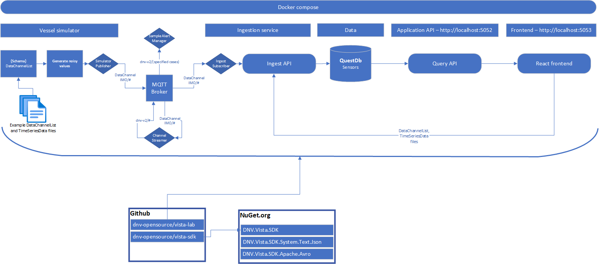

## Vista lab

This repository contains a full-stack sample implementation of the DNV naming rule for ISO 19848.
Our aim is to let this application serve as an introduction into what users can do with the naming rule and ISO standard.
We also want to identify and give guidance on topics that are important to consider when implementing the naming rule:

* Storage, indexing, querying,
* VIS versioning

---
**NOTE**

This lab project is still under active development.
---

### Try it out

```sh
docker-compose up -d
```

### Architecture


